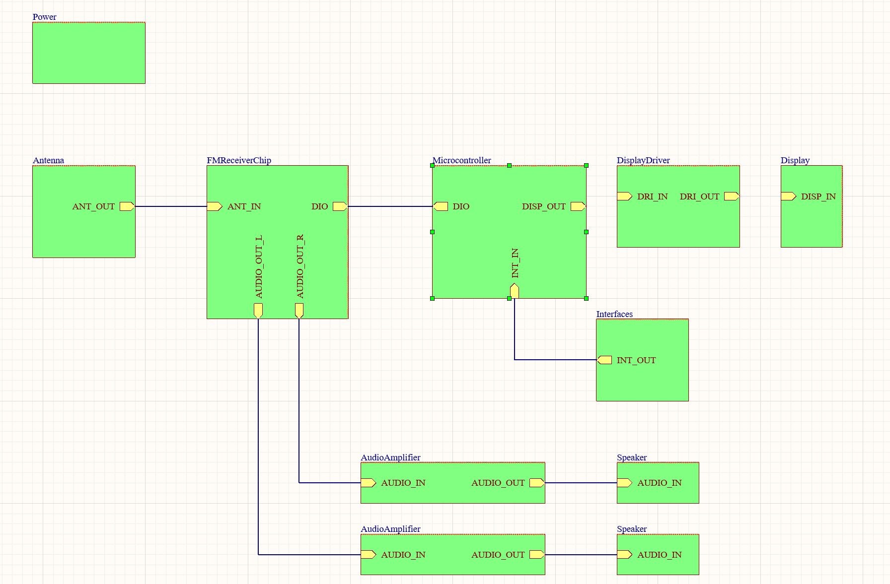

# FM Radio Receiver PCB

A complete **FM radio receiver system designed in Altium Designer**, integrating RF reception, signal processing, audio amplification, and power management into a single hardware platform.

## Overview

This project explores the complete design of an FM radio receiver, following the signal from the antenna through the RF and analog circuitry to the final audio output.

The system is organized around the following signal path:

**Antenna → RF Front End → FM Receiver → Audio Processing → Audio Amplifier → Output**

The objective is not only to design the individual circuits, but to understand how RF, analog, power, and PCB design considerations interact within a complete electronic system.

## Key Design Areas

- FM-band RF reception
- Antenna and RF front-end design
- FM demodulation
- Analog signal processing
- Audio amplification
- Power regulation and distribution
- Filtering and decoupling
- Component selection
- Schematic capture and system integration
- PCB layout and grounding

##System 

## Engineering Objectives

This project is being developed to build practical experience with:

- RF and analog circuit design
- Signal-chain architecture
- Datasheet analysis and component selection
- Power-supply design
- Noise and interference management
- Schematic organization
- PCB layout
- Hardware bring-up and validation
- Oscilloscope-based measurements and debugging

## Tools

- Altium Designer
- Circuit simulation and analysis tools
- Component datasheets and reference designs
- Oscilloscope and laboratory test equipment

## Repository Contents

The repository contains the Altium project and associated design files for the FM radio system.

As development progresses, the repository will include:

- Schematics
- PCB layout
- Design calculations
- Bill of Materials (BOM)
- Simulation results
- Manufacturing files
- Bring-up procedures
- Hardware measurements
- Design revisions

## Project Status

**Work in Progress**

The FM radio system is currently under active development. Schematics, PCB implementation, testing, and documentation will be updated as each subsystem is designed and validated.
